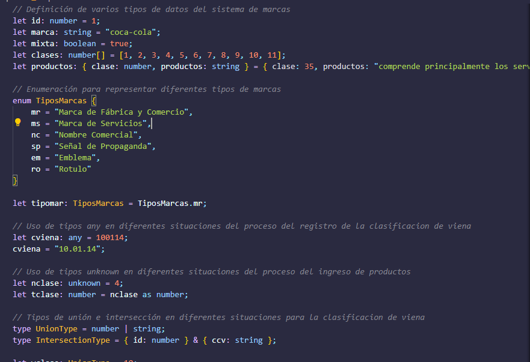

# &reg; Proyecto SISPIMAR
Este proyecto es un sistema diseñado para administrar los registros de marcas, incluyendo sus renovaciones, anotaciones y otras solicitudes que se presentan ante el Registro de la Propiedad Intelectual (RPI, para obtener la debida protección de las marcas comerciales.


##### Código Desarrollado en TypeScript:
- Varios tipos de datos diferentes.
- Enumeraciones para representar diferentes valores.
- Los tipos any y unknown en diferentes situaciones.
- Los tipos de unión e intersección en diferentes situaciones.
- Los tipos de colección en diferentes situaciones.


##### Vista Previa del Código Desarrollado:

###### Pantalla N° 1




#### Módulos del Sistema:
```
Registro de Marcas
Renovaciones
Anotaciones
Oposiciones Presentadas
Control de Trámite
Entre otros...

```
#### Contribuciones


#### Licencia
MIT
